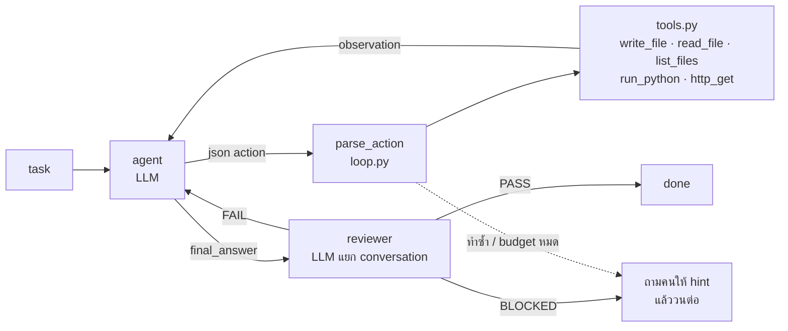

# mini-agent

[](https://github.com/NithichoteC/mini-agent/actions/workflows/tests.yml)

Agent ขนาดเล็กที่ให้ LLM ทำงานจริงในโฟลเดอร์ได้ (เขียนไฟล์ รันโค้ด ดึงเว็บ) โดยตัวระบบเป็นคน
**แปลงข้อความที่โมเดลตอบให้กลายเป็น action** แล้วส่งผลลัพธ์กลับไปให้โมเดลดูต่อ วนจนงานเสร็จ
ทุกอย่างตั้งค่าได้จากไฟล์เดียวคือ [`config/workflow.yaml`](config/workflow.yaml) โดยไม่ต้องแก้โค้ด



## เริ่มใช้งาน

```bash
pip install -r requirements.txt
cp .env.example .env                 # ใส่ GROQ_API_KEY=... (ไฟล์ .env ไม่ถูก commit)

python -m unittest -v                # 31 tests ไม่ต้องมี API key
python sandbox.py                    # ทดสอบ sandbox อย่างเดียว
python llm_handler.py "say hi"       # ทดสอบว่า key ใช้ได้

python main.py config/workflow.yaml "create me a simple calculator and use it to calculate 15% tip on 240 baht"
python main.py config/workflow.yaml "create index.html showing the first 10 prime numbers in an html table"
python main.py config/workflow.yaml "fetch https://example.com and save the page title into title.txt"
```

พิมพ์งานเป็นภาษาธรรมดาได้เลย ไม่ต้องบอกให้ตรวจสอบ — system prompt สั่งไว้แล้ว คำตอบสุดท้ายเป็นข้อความปกติ
ผลลัพธ์อยู่ใน `sandbox/runs/run_NNN/` (หนึ่งโฟลเดอร์ต่อหนึ่ง session พร้อม `session.json`) และ transcript
ทั้งหมดใน `sandbox/logs/workflow.log`

### สิ่งที่เห็นบนหน้าจอ

หนึ่งบรรทัดต่อหนึ่ง action ส่วน prompt/คำตอบ/observation ฉบับเต็มอยู่ใน log

```text
tool-agent · qwen/qwen3.8-27b
task: create me a simple calculator and use it to calculate 15% tip on 240 baht

 1  write_file  path=calculator.py  content=def add(a, b): ⏎     return a + b ⏎  ⏎ def subtract(a, b): …
    → wrote calculator.py (558 chars)
 2  run_python  path=calculator.py
    → exit 0 ⏎ stdout: ⏎ Bill: 240 baht ⏎ 15% tip: 36.0 baht ⏎ Total: 276.0 baht
 3  final_answer  answer=I created a simple calculator (calculator.py) with add, sub…
    review → PASS

done · 3 actions · 2,344 tokens
answer:    I created a simple calculator (calculator.py) with add, subtract, multiply, divide, and
           calculate_tip functions. Using it, a 15% tip on 240 baht is 36.0 baht.
workspace: sandbox/runs/run_001
files:     calculator.py  558 bytes
```

## โครงสร้าง

```text
mini-agent/
├─ main.py                 # CLI: อ่าน yaml, รัน workflow, ถาม hint เมื่อ agent ติด, เขียน session.json
├─ loop.py                 # engine: รัน steps จาก yaml, parse action, ตรวจการทำซ้ำ, วนจนจบ
├─ tools.py                # เครื่องมือที่ agent เรียกได้ (จำกัด path ใน workspace, http เฉพาะ public)
├─ sandbox.py              # workspace ต่อ session และรัน Python ข้างในด้วย subprocess + timeout
├─ llm_handler.py          # call_llm(messages) และ call_LLM(model, prompt, role, provider) -> Groq
├─ config/workflow.yaml
├─ tests/test_agent.py     # 31 offline tests: แทน LLM ด้วยคำตอบที่เขียนไว้ล่วงหน้า
├─ .github/workflows/      # รัน tests ทุก push
└─ sandbox/
   ├─ runs/run_001/        # ไฟล์ที่ agent เขียน, session.json, .exec/ (โค้ดและ output ของ run_python)
   └─ logs/                # sandbox.log (1 บรรทัดต่อการรัน), workflow.log (transcript)
```

## ระบบทำงานอย่างไร

หนึ่งรอบ (`run`) ของ loop คือ

1. **act** — ส่ง conversation ทั้งหมดให้ agent เลือกหนึ่ง action มีสองโปรโตคอล (`llm.actions`)
   - `json_text` (ค่าเริ่มต้น, flow ของวิชา): agent ตอบด้วย ```` ```json {"tool": ..., "args": {...}} ````
     `parse_action()` ดึง JSON ออกมา (รับทั้งแบบมี `args`, แบบแบน, และ JSON ที่ฝังในร้อยแก้ว)
   - `tool_calls` (native function calling): ประกาศ tools ให้ API แล้วโมเดลตอบเป็น `tool_calls` ที่มีโครงสร้าง
     observation ส่งกลับเป็น message `role: tool` ตอบเป็นข้อความเฉย ๆ = จบงาน
   จากนั้น dispatch ไปที่ `tools.py`
   ถ้าไม่มี JSON / เรียก tool ที่ไม่ได้อนุญาต / ชื่อ argument ผิด / path หลุดนอก workspace ข้อความ error
   (พร้อม signature ของ tool) จะกลายเป็น observation ส่งกลับให้โมเดลแก้เอง ไม่ crash
   - tool ใน `confirm:` ต้องให้คนกด y ก่อน ถ้าตอบ n หรือไม่มี terminal จะถูกปฏิเสธ (ยกเว้นรันด้วย `--yes`)
   - action ที่เหมือนเดิมทุกประการติดกัน `max_repeats` ครั้ง = `no_progress` หยุดแล้วถามคน
2. **review** — รันเฉพาะเมื่อ agent เรียก `final_answer` (`when: answered`) reviewer เป็น **conversation
   แยก** มี system prompt ของตัวเอง (`prompts.reviewer`) เห็นเฉพาะ task, คำตอบ, tools ที่ agent มี และ
   ไฟล์ใน workspace ตอบ `VERDICT: PASS` / `FAIL` (บอกว่าขาดอะไร) / `BLOCKED` (agent บอกว่าทำไม่ได้
   ด้วย tools ที่มี และเป็นความจริง) ผลตัดสินถูกส่งให้ agent ผ่าน `{review}` ใน `retry_prompt`
3. **stop_if** — `review_pass` จบงาน, `review_blocked` / `no_progress` จบด้วยสถานะนั้น, ไม่เข้าเงื่อนไขก็วนต่อ

เมื่อ blocked, no_progress หรือครบ `max_runs` `main.py` จะถาม hint จากผู้ใช้ session เดิม (conversation,
workspace, จำนวน token) ถูกใช้ต่อพร้อม budget ใหม่ โดย task ยังเป็นอันเดิม (กด Enter เปล่าเพื่อหยุด)

### สัญญาของแต่ละส่วน

| ฟังก์ชัน | รับ | คืน |
|---|---|---|
| `call_llm(messages, model, ...)` | conversation | `{"ok": True, "text", "usage"}` หรือ `{"ok": False, "error": {"code", "message", "provider", "model"}}` |
| `call_LLM(model, prompt, role, provider)` | prompt เดียว (signature ตามที่เรียนในวิชา) | ข้อความ หรือ error dict แบบเดียวกัน |
| `sandbox.run(code, workspace)` | โค้ด + โฟลเดอร์ | `{"stdout", "stderr", "exit_code", "timed_out", "duration_ms"}` |
| `tools.TOOLS[name](ctx, **args)` | ctx = workspace + limits | string (observation) |
| `run_workflow(cfg, task, previous=, hint=)` | yaml dict + task (+ ผลรอบก่อนเพื่อทำต่อ) | `{"status": done / blocked / no_progress / max_runs / llm_error, "runs", "total_tokens", "state", "messages", "workspace"}` |

## ตั้งค่าโดยไม่แก้โค้ด (`config/workflow.yaml`)

| ส่วน | ทำอะไร |
|---|---|
| `tools:` | รายการเครื่องมือที่อนุญาต (ตารางด้านล่าง) ลบบรรทัดออก = โมเดลไม่เห็น tool นั้น (`final_answer` มีเสมอ) |
| `confirm:` | tool ที่ต้องให้คนกด y ก่อนรัน เช่น `[run_python, http_get]` ไม่มีคน = ไม่รัน |
| `loop.max_runs` | จำนวน action สูงสุดก่อนถามคน |
| `loop.max_repeats` | action เดิมซ้ำติดกันกี่ครั้งถึงถือว่าไม่คืบหน้า |
| `sandbox.timeout_sec` | ฆ่า `run_python` ที่รันนานเกิน |
| `sandbox.max_output_chars` | ตัด output ของทุก tool และจำกัดขนาดรวมของไฟล์ที่ reviewer เห็น |
| `llm.model` | โมเดลของ agent `steps[].model` override รายขั้น — reviewer ใช้ `openai/gpt-oss-120b` |
| `llm.actions` | `json_text` (โมเดลเขียน JSON ระบบ parse) หรือ `tool_calls` (native function calling) |
| `prompts.system`, `prompts.reviewer`, `steps[].prompt` / `retry_prompt` / `hint_prompt` | ข้อความที่ส่งให้โมเดล ใช้ `{task}` `{hint}` `{observation}` `{review}` `{files}` `{answer}` `{tools}` ได้ ส่วน `{...}` อื่นเช่นตัวอย่าง JSON ปล่อยไว้ตามเดิม |
| `steps[].system` | ให้ step นั้นรันใน conversation ของตัวเอง ด้วย prompt ชื่อนั้นจาก `prompts:` |
| `steps[].when` | เงื่อนไขก่อนรัน step (`answered`, `review_pass`, `review_blocked`, `no_progress`) เพิ่มได้ที่ `CONDITIONS` ใน `loop.py` |
| `steps[].status` | (เฉพาะ `stop_if`) สถานะที่จะจบด้วย ค่าเริ่มต้น `done` |

เครื่องมือทั้งหมดที่มี (นิยามใน `tools.py`)

| tool | ทำอะไร | ขอบเขต |
|---|---|---|
| `write_file(path, content)` | สร้าง/เขียนทับไฟล์ข้อความ — html, csv, py, md ได้หมด | path ต้องอยู่ใน workspace |
| `read_file(path)` | อ่านไฟล์ | เหมือนกัน |
| `list_files()` | ดูรายชื่อไฟล์และขนาด | |
| `run_python(code \| path)` | รัน Python source หรือไฟล์ .py ใน workspace | timeout, ตัด output — แต่โค้ดเข้าถึงเครื่องได้ (ดูข้อจำกัด) |
| `http_get(url)` | ดึงหน้าเว็บมาเป็นข้อความ | http(s) เท่านั้น, ปฏิเสธ localhost/private IP, ไม่ตาม redirect, อ่านแค่ `max_output_chars` |

เพิ่ม tool ใหม่ = เขียนฟังก์ชันใน `tools.py` (รับ `ctx` + keyword args คืน string) ใส่ใน `TOOLS` แล้วเพิ่มชื่อใน yaml
บรรทัดแรกของ docstring คือสิ่งที่โมเดลเห็น

## เทียบกับหนังสือ (Hitchhiker's Guide to Agentic AI, arXiv 2606.24937)

บทที่ 19 *Loop Engineering* มอง agent loop เป็น RL ตอน inference:
`s_t = context(s_{t-1}, a_{t-1}, o_{t-1})`, `a_t = π(s_t)`, `o_t = env(a_t)`, reward `r_t`

| primitive ในหนังสือ | ในโปรเจกต์นี้ |
|---|---|
| state manager | `messages` ของ agent ที่ append action/observation ทุกรอบ |
| generator | step `act` |
| environment | `tools.py` + `sandbox.py` — observation คือ string ที่ tool คืน |
| verifier | step `review` ใน conversation แยก (`VERDICT: PASS/FAIL/BLOCKED`) |
| terminator | `stop_if` (`review_pass`, `review_blocked`, `no_progress`) และ `loop.max_runs` |
| escalator | `main.py` ถาม hint จากคนแล้ววนต่อด้วย session เดิม |

§19.6 จัดลำดับ verifier ตามความน่าเชื่อถือ: deterministic (tests, exit code) สูงกว่า LLM-as-judge
ตัวตรวจของโปรเจกต์นี้เป็น LLM ซึ่งเป็นขั้นต่ำสุด — เห็นผลจริงในบทเรียนข้อ 1

## ผลการทดลอง (agent `qwen/qwen3.8-27b`, reviewer `openai/gpt-oss-120b`)

### งานปกติ

| task | actions | tokens | ผล |
|---|---|---|---|
| create me a simple calculator and use it to calculate 15% tip on 240 baht | 4 | 3,046 | PASS — `write_file` → `run_python path=` → คำตอบพร้อมตัวเลข |
| สร้าง index.html ตารางจำนวนเฉพาะ 10 ตัว | 2 | 2,113 | PASS |
| ดึง example.com เซฟ `<title>` ลง title.txt | 3 | 1,849 | PASS — `http_get` → `write_file` |
| what is 3-10 | 1 | 702 | PASS — ตอบตรงโดยไม่ใช้ tool |
| calculator อีกครั้งด้วย `actions: tool_calls` | 3 | 4,299 | PASS — โปรโตคอล native ใช้ได้กับ qwen เช่นกัน |

### ทดลองขอบเขต (ตั้งใจทำให้ระบบอยู่ในสภาพไม่ปกติ)

| setup | คาดหวัง | ผลจริง |
|---|---|---|
| ตัด `http_get` ออกจาก `tools:` แล้วสั่งดึงเว็บ | โมเดลหาทางอื่น | ✓ ใช้ `run_python` + `urllib` แทน — PASS ใน 4 actions |
| เหลือแค่ `read_file`, `list_files` แล้วสั่งสร้างไฟล์ | agent บอกว่าทำไม่ได้แล้วส่งต่อให้คน | ✓ `blocked` ใน 3 actions, 2,679 tokens — เวอร์ชันแรกของโปรเจกต์วน 8 actions, 37,718 tokens โดยโมเดลแปะ HTML ลง `final_answer` แล้วอ้างว่าเสร็จ |

แถวแรกบอกเรื่องสำคัญ: `tools:` คือสิ่งที่โมเดล *เห็น* ไม่ใช่ขอบเขตความปลอดภัย ตราบใดที่มี `run_python`
โมเดลทำได้ทุกอย่างที่ Python ทำได้ ขอบเขตจริงต้องอยู่ที่ runtime (Docker) หรือให้คนกดยืนยัน (`confirm:`)
แถวที่สองบอกว่าสิ่งที่ทำให้ loop หยุดเร็วคือ verifier ที่มีทางออกที่สาม ไม่ใช่แค่ budget

## บันทึกการทำงานและบทเรียน

**v1 — code agent:** `sandbox.py`, `llm_handler.py`, `loop.py`, yaml — โมเดลเขียน Python → รัน → โมเดลตรวจ
stdout → PASS/FAIL → วน

**v2 — tool agent:** `tools.py` และ step `act` (โมเดลตอบ JSON action ระบบ dispatch) workspace ต่อ session,
escalator, `when:` guard, offline tests ตัด code agent เดิมออกเพราะ `run_python` ครอบคลุมแล้ว

**v3 — ทำให้สิ่งที่เคย "หวัง" กลายเป็น "บังคับ":** reviewer แยก conversation, ตรวจการทำซ้ำใน runtime,
`confirm:` ปฏิเสธเมื่อไม่มีคน, `http_get` จำกัดปลายทาง, ขนาดรวมของ context ที่ reviewer เห็นมีเพดาน,
escalation เก็บ task และจำนวน token เดิม, `call_LLM` ตาม signature ของวิชา, CI

บทเรียนที่ได้ระหว่างทาง

1. **LLM ตรวจงานตัวเองแบบใจดี** — task อ่าน `numbers.txt` ที่ไม่มีอยู่ โค้ดพิมพ์ "not found" แล้ว review
   ให้ PASS แก้ที่ prompt: ตัดสินจากหลักฐานเท่านั้น ข้อความ error = FAIL
2. **Groq free tier จำกัด 8,000 tokens/นาที** และ conversation โตทุกรอบเพราะส่งประวัติทั้งหมดซ้ำ
   เพิ่ม retry ตาม header `retry-after` และคุมด้วย `max_runs` + `max_output_chars`
3. **prompt ที่เขียนว่า "when asked for code" เป็นช่องโหว่** — "what is 3-10" ได้คำตอบเป็นร้อยแก้ว
4. **โมเดลที่ *ทำ* กับโมเดลที่ *ตัดสิน* ไม่จำเป็นต้องเป็นตัวเดียวกัน** — `steps[].model` ทำให้เลือกโมเดลตาม
   บทบาทได้ ปัจจุบัน agent ใช้ qwen และ reviewer ใช้ gpt-oss-120b
5. **allowlist ไม่ใช่ sandbox** (ผลการทดลองขอบเขตแถวแรก)
6. **`str.format` พังเมื่อ prompt มี `{"tool": ...}`** — จึงเขียน `render()` ที่แทนเฉพาะ `{placeholder}` ที่รู้จัก
7. **กฎสองข้อใน system prompt เปลี่ยนพฤติกรรมมากกว่าโค้ดใด ๆ** — "never claim you did something unless a
   tool observation shows it" และ "never repeat an action with the same arguments" ทำให้ agent ที่ไม่มี
   write tool เลิกอ้างว่าเสร็จและบอกตรง ๆ ว่าทำไม่ได้
8. **verifier ต้องมีทางออกมากกว่า PASS/FAIL** — เมื่อ agent บอกตรง ๆ ว่าทำไม่ได้ reviewer ที่รู้จักแค่ FAIL
   จะตีกลับไปเรื่อย ๆ จนหมด budget เพิ่ม `VERDICT: BLOCKED` → หยุดแล้วส่งต่อให้คน
9. **parser ต้องรับรูปแบบที่โมเดล "เกือบถูก"** — โมเดลส่ง JSON แบบแบนโดยไม่มี `args` แล้ว error
   "missing argument" ไม่ได้บอกสาเหตุ วน 8 รอบ แก้โดยรับทั้งสองรูปแบบและส่ง signature กลับไปเมื่อผิด
10. **กฎใน prompt ต้องมี runtime หนุน** — บอกโมเดลว่าอย่าทำซ้ำก็ยังไม่พอ engine จึง fingerprint
    `(tool, args)` และหยุดเองเมื่อซ้ำครบ `max_repeats`
11. **approval gate ต้อง fail closed** — เวอร์ชันแรก `confirm:` อนุมัติเองเมื่อไม่มี terminal เพื่อให้
    test ผ่าน ซึ่งคือเหตุผลที่ผิด ตอนนี้ไม่มีคน = ไม่รัน (มี `--yes` ให้เลือกเปิดเอง)
12. **reviewer ที่ใช้ conversation เดียวกับ agent ได้รับคำสั่งขัดกัน** ("ตอบ JSON เท่านั้น" กับ "ตอบ VERDICT")
    ทำงานได้กับโมเดลที่ทดสอบแต่เปราะ แยกเป็น conversation ของตัวเองแล้ว token ลดลงด้วย (calculator
    2,868 → 2,344) และเปลี่ยนโมเดลของ reviewer แยกได้
13. test จับ bug ใน engine ได้ก่อนใช้จริง — `stop_if` ที่ไม่เข้าเงื่อนไขเคย `break` ออกจาก steps ทำให้
    `stop_if` ตัวที่สองไม่มีวันถูกรัน

## ข้อจำกัดและงานต่อ

- **`run_python` ยังเข้าถึงเครื่องได้** — path jail ของ `read_file`/`write_file` และขอบเขตของ `http_get`
  ไม่ครอบคลุมโค้ดที่โมเดลเขียนเอง ทางแก้จริงคือ Docker (`--network none`, mount เฉพาะ workspace)
  โดย contract ของ `sandbox.run()` ไม่ต้องเปลี่ยน ระหว่างนี้ใช้ `confirm: [run_python]`
- **verifier เป็น LLM** — ขั้นต่อไปตามหนังสือคือ deterministic check เช่น test script หรือ schema ที่ผู้ใช้ให้มา
  แล้วให้ LLM ตัดสินเฉพาะส่วนที่เป็น subjective
- **ไม่มีการย่อประวัติสนทนา** — `max_runs` กับเพดาน output พอสำหรับ free tier แต่ session ยาวจะชน context window

## โมเดลที่ใช้

| บทบาท | โมเดล | ตั้งค่าที่ |
|---|---|---|
| agent (เลือก action) | `qwen/qwen3.8-27b` | `llm.model` |
| reviewer (ตัดสิน PASS / FAIL / BLOCKED) | `openai/gpt-oss-120b` | `steps[].model` ของ step `review` |

ทั้งสองผ่าน Groq ด้วย key เดียวกัน เปลี่ยนโมเดลได้จาก yaml โดยไม่แก้โค้ด

## อ้างอิง

- Hitchhiker's Guide to Agentic AI — https://arxiv.org/abs/2606.24937
- Groq API — https://console.groq.com/docs/api-reference#chat-create
- smolagents — https://github.com/huggingface/smolagents
- llm-sandbox — https://github.com/vndee/llm-sandbox
