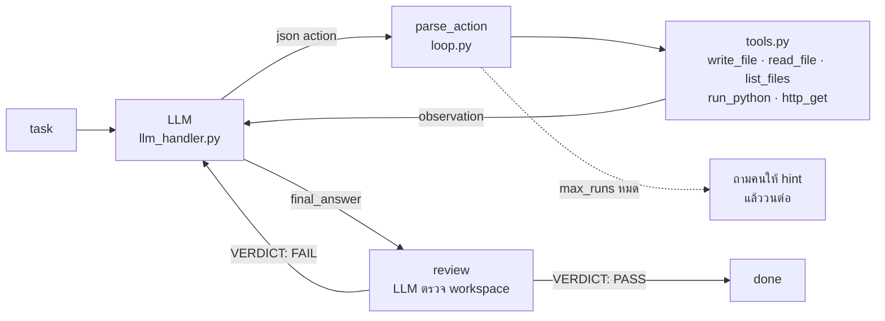

# mini-agent

Agent ขนาดเล็กที่ให้ LLM ทำงานจริงในโฟลเดอร์ได้ (เขียนไฟล์ รันโค้ด ดึงเว็บ) โดยตัวระบบเป็นคน
**แปลงข้อความที่โมเดลตอบให้กลายเป็น action** แล้วส่งผลลัพธ์กลับไปให้โมเดลดูต่อ วนจนงานเสร็จ
ทุกอย่างตั้งค่าได้จากไฟล์เดียวคือ [`config/workflow.yaml`](config/workflow.yaml) โดยไม่ต้องแก้โค้ด



## เริ่มใช้งาน

```bash
pip install -r requirements.txt
cp .env.example .env                 # ใส่ GROQ_API_KEY=... (ไฟล์ .env ไม่ถูก commit)

python -m unittest -v                # 14 tests ไม่ต้องมี API key
python sandbox.py                    # ทดสอบ sandbox อย่างเดียว
python llm_handler.py "say hi"       # ทดสอบว่า key ใช้ได้

python main.py config/workflow.yaml "create index.html showing the first 10 prime numbers in an html table"
python main.py config/workflow.yaml "fetch https://example.com and save the page title into title.txt"
```

ผลลัพธ์อยู่ใน `sandbox/runs/run_NNN/` (หนึ่งโฟลเดอร์ต่อหนึ่ง session) และ transcript ทั้งหมดใน `sandbox/logs/workflow.log`

## โครงสร้าง

```text
mini-agent/
├─ main.py             # CLI: อ่าน yaml, รัน workflow, ถาม hint จากคนเมื่อ budget หมด
├─ loop.py             # engine: รัน steps จาก yaml, parse action, วนจนจบ
├─ tools.py            # เครื่องมือที่ agent เรียกได้ (จำกัด path ไว้ใน workspace)
├─ sandbox.py          # สร้าง workspace ต่อ session และรัน Python ข้างในด้วย subprocess + timeout
├─ llm_handler.py      # call_llm(messages) -> Groq; ไม่ raise, retry เมื่อโดน 429
├─ config/workflow.yaml
├─ tests/test_agent.py # offline tests: แทน LLM ด้วยคำตอบที่เขียนไว้ล่วงหน้า
└─ sandbox/
   ├─ runs/run_001/    # ไฟล์ที่ agent เขียน + .exec/ (โค้ดและ stdout/stderr ของแต่ละ run_python)
   └─ logs/            # sandbox.log (1 บรรทัดต่อการรัน), workflow.log (transcript)
```

## ระบบทำงานอย่างไร

หนึ่งรอบ (`run`) ของ loop คือ

1. **act** — ส่ง conversation ทั้งหมดให้โมเดล โมเดลตอบด้วย ```` ```json {"tool": ..., "args": {...}} ````
   `parse_action()` ดึง JSON ออกมา ถ้าไม่มี / ผิดรูป / เรียก tool ที่ไม่ได้อนุญาต / path หลุดนอก workspace
   ข้อความ error จะกลายเป็น observation ส่งกลับให้โมเดลแก้เอง ไม่ crash
2. **review** — รันเฉพาะเมื่อโมเดลเรียก `final_answer` (`when: answered`) โมเดลจะเห็นไฟล์ทั้งหมดใน
   workspace แล้วตอบ `VERDICT: PASS` หรือ `FAIL` พร้อมบอกว่าขาดอะไร
3. **stop_if** — `when: review_pass` จบงาน ไม่ผ่านก็วนรอบต่อไป

ถ้าครบ `max_runs` แล้วยังไม่ผ่าน `main.py` จะพิมพ์ observation ล่าสุดแล้วถาม hint จากผู้ใช้
conversation และ workspace เดิมถูกใช้ต่อพร้อม budget ใหม่ (กด Enter เปล่าเพื่อหยุด)

สิ่งที่โมเดลเห็นคือ `messages` list เดียว: system prompt, task, action ที่ตัวเองตอบ, observation,
review ... ต่อกันไปเรื่อย ๆ นี่คือ "feedback loop" — ไม่มีการส่งผลลัพธ์แยกต่างหาก ทุกอย่างอยู่ในประวัติสนทนา

### สัญญาของแต่ละไฟล์

| ฟังก์ชัน | รับ | คืน |
|---|---|---|
| `call_llm(messages, model, ...)` | conversation | `{"ok": True, "text", "usage"}` หรือ `{"ok": False, "error": {"code", "message"}}` |
| `sandbox.run(code, workspace)` | โค้ด + โฟลเดอร์ | `{"stdout", "stderr", "exit_code", "timed_out", "duration_ms"}` |
| `tools.TOOLS[name](ctx, **args)` | ctx = workspace + limits | string (observation) |
| `run_workflow(cfg, task)` | yaml dict + task | `{"status": done / max_runs / llm_error, "runs", "total_tokens", "state", "messages", "workspace"}` |

## ตั้งค่าโดยไม่แก้โค้ด (`config/workflow.yaml`)

| ส่วน | ทำอะไร |
|---|---|
| `tools:` | รายการเครื่องมือที่อนุญาต ลบบรรทัดออก = โมเดลไม่เห็น tool นั้น (`final_answer` มีเสมอ) |
| `loop.max_runs` | จำนวน action สูงสุดก่อนถามคน |
| `sandbox.timeout_sec` | ฆ่า `run_python` ที่รันนานเกิน |
| `sandbox.max_output_chars` | ตัด output ก่อนส่งกลับโมเดล กัน `print` วนลูปกิน context |
| `llm.model` | โมเดลบน Groq (ดูหมายเหตุเรื่องโมเดลด้านล่าง) |
| `prompts.system`, `steps[].prompt` / `retry_prompt` | ข้อความที่ส่งให้โมเดล ใช้ `{task}` `{observation}` `{files}` `{answer}` `{tools}` ได้ ส่วน `{...}` อื่นเช่นตัวอย่าง JSON ปล่อยไว้ตามเดิม |
| `steps[].when` | เงื่อนไขก่อนรัน step (`answered`, `review_pass`) เพิ่มเงื่อนไขใหม่ได้ที่ `CONDITIONS` ใน `loop.py` |

ตัวอย่าง: agent แบบอ่านอย่างเดียว = เหลือ `tools:` แค่ `read_file` กับ `list_files`

## เทียบกับหนังสือ (Hitchhiker's Guide to Agentic AI, arXiv 2606.24937)

บทที่ 19 *Loop Engineering* มอง agent loop เป็น RL ตอน inference:
`s_t = context(s_{t-1}, a_{t-1}, o_{t-1})`, `a_t = π(s_t)`, `o_t = env(a_t)`, reward `r_t`

| primitive ในหนังสือ | ในโปรเจกต์นี้ |
|---|---|
| state manager | `messages` list ที่ append action/observation ทุกรอบ |
| generator | step `act` |
| environment | `tools.py` + `sandbox.py` — observation คือ string ที่ tool คืน |
| verifier | step `review` (`VERDICT: PASS/FAIL`) |
| terminator | `stop_if when: review_pass` และ `loop.max_runs` |
| escalator | เมื่อ `max_runs` หมด `main.py` ถาม hint จากคนแล้ววนต่อด้วย conversation เดิม |

§19.6 จัดลำดับ verifier ตามความน่าเชื่อถือ: deterministic (tests, exit code) สูงกว่า LLM-as-judge
ตัวตรวจของโปรเจกต์นี้เป็น LLM ซึ่งเป็นขั้นต่ำสุด — เห็นผลจริงในบทเรียนข้อ 1

## ผลการทดลอง (`qwen/qwen3.8-27b`)

### งานปกติ

| task | runs | tokens | ผล |
|---|---|---|---|
| สร้าง index.html ตารางจำนวนเฉพาะ 10 ตัว | 2 | 2,912 | PASS — `write_file` แล้ว `final_answer` |
| what is 3-10 | 1 | 578 | PASS — ตอบตรงโดยไม่ใช้ tool |
| ดึง example.com เซฟ `<title>` ลง title.txt | 3 | 1,656 | PASS — ใช้ `run_python` + `urllib` |

### ทดลองขอบเขต (ตั้งใจทำให้ระบบอยู่ในสภาพไม่ปกติ)

| setup | คาดหวัง | ผลจริง |
|---|---|---|
| ตัด `http_get` ออกจาก `tools:` แล้วสั่งดึงเว็บ | โมเดลหาทางอื่น | ✓ ใช้ `run_python` + `urllib` แทน — PASS ใน 3 runs |
| เหลือแค่ `read_file`, `list_files` แล้วสั่งสร้างไฟล์ | ทำไม่ได้ terminator ต้องหยุด | ✓ review FAIL 6 ครั้ง จบที่ `max_runs` (8 runs, 37,718 tokens) รอบสุดท้ายพยายามเรียก `write_file` ที่ไม่มี |
| เปลี่ยนโมเดลเป็น `openai/gpt-oss-120b` | — | content ว่างทุกรอบ ทำงานไม่ได้ (ดูบทเรียนข้อ 4) |

สองแถวแรกคู่กันบอกเรื่องสำคัญ: `tools:` คือสิ่งที่โมเดล *เห็น* ไม่ใช่ขอบเขตความปลอดภัย ตราบใดที่มี
`run_python` โมเดลทำได้ทุกอย่างที่ Python ทำได้ ขอบเขตจริงต้องอยู่ที่ runtime (เช่น Docker `--network none`)
และเมื่อไม่มีทางไปต่อ loop ไม่ converge — `max_runs` กับ escalator คือสิ่งที่หยุดมัน

## บันทึกการทำงานและบทเรียน

**v1 — code agent:** `sandbox.py` (subprocess + timeout + truncate), `llm_handler.py` (Groq ตัวเดียว),
`loop.py`, yaml — โมเดลเขียน Python → รัน → โมเดลตรวจ stdout → PASS/FAIL → วน

**v2 — tool agent:** เพิ่ม `tools.py` และ step `act` (โมเดลตอบ JSON action ระบบ dispatch), workspace ต่อ
session, escalator, `when:` guard, `tests/` 14 ข้อรันได้โดยไม่มี key ตัด code agent เดิมออกเพราะ `run_python`
ครอบคลุมแล้ว

บทเรียนที่ได้ระหว่างทาง

1. **LLM ตรวจงานตัวเองแบบใจดี** — task อ่าน `numbers.txt` ที่ไม่มีอยู่ โค้ดพิมพ์ "not found" แล้ว review
   ให้ PASS แก้ที่ prompt: ตัดสินจาก stdout เท่านั้น ข้อความ error = FAIL
2. **Groq free tier จำกัด 8,000 tokens/นาที** และ conversation โตทุกรอบเพราะส่งประวัติทั้งหมดซ้ำ
   (5 รอบ = 16k tokens) เพิ่ม retry ตาม header `retry-after` และคุมด้วย `max_runs` + `max_output_chars`
3. **prompt ที่เขียนว่า "when asked for code" เป็นช่องโหว่** — "what is 3-10" ได้คำตอบเป็นร้อยแก้ว
   ต้องบอกให้ตอบเป็นโค้ดเสมอ
4. **reasoning model มี output channel** — `gpt-oss-120b` บน Groq ใส่ JSON action ไว้ใน field `reasoning`
   แล้วคืน `content` ว่าง `gpt-oss-20b` พยายาม native tool call จน Groq ปฏิเสธ ("model called a tool")
   design แบบ parse-the-text ต้องใช้โมเดลที่เขียนข้อความจริง ๆ → `qwen3.8-27b`
5. **allowlist ไม่ใช่ sandbox** (ผลการทดลองขอบเขตแถวแรก)
6. **`str.format` พังเมื่อ prompt มี `{"tool": ...}`** — คนแก้ yaml จะวางตัวอย่าง JSON แน่นอน จึงเขียน
   `render()` ที่แทนเฉพาะ `{placeholder}` ที่รู้จัก

## ข้อจำกัดและงานต่อ

- sandbox เป็นโฟลเดอร์ ไม่ใช่ jail: `run_python` เข้าถึงเครื่องได้ ทางแก้คือ Docker (แบบ llm-sandbox /
  smolagents remote executor) โดย contract ของ `sandbox.run()` ไม่ต้องเปลี่ยน
- verifier เป็น LLM อย่างเดียว ขั้นต่อไปตามหนังสือคือ deterministic check เช่น test script ที่ผู้ใช้ให้มา
- ไม่มีการย่อประวัติสนทนา `max_runs: 8` พอสำหรับ free tier แต่ session ยาวจะชน context window

## หมายเหตุเรื่องโมเดล

ใช้ `qwen/qwen3.8-27b` โมเดล llama บน Groq ถูกถอดไปแล้ว ส่วน gpt-oss ใช้กับโปรโตคอลนี้ไม่ได้
ด้วยเหตุผลข้างต้น เปลี่ยนโมเดลได้ที่ `llm.model` ใน yaml บรรทัดเดียว

## อ้างอิง

- Hitchhiker's Guide to Agentic AI — https://arxiv.org/abs/2606.24937
- smolagents — https://github.com/huggingface/smolagents
- llm-sandbox — https://github.com/vndee/llm-sandbox
- MinimalAgent — https://github.com/99991/MinimalAgent
- Groq API — https://console.groq.com/docs/api-reference#chat-create
